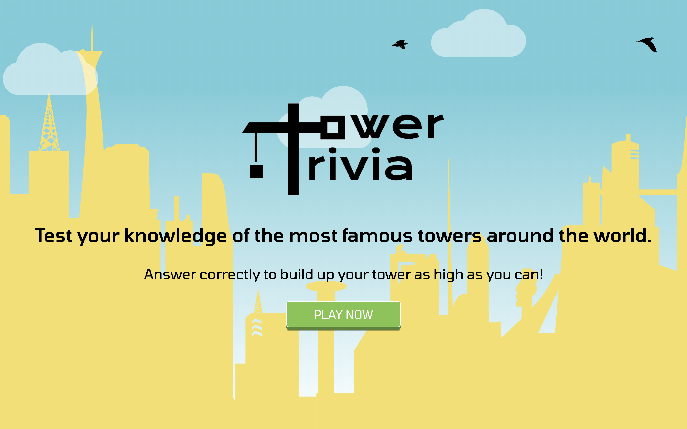
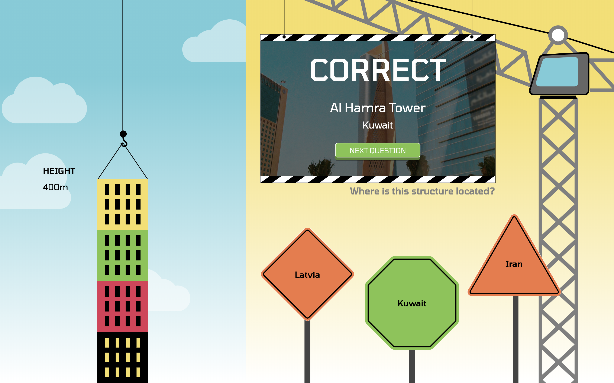
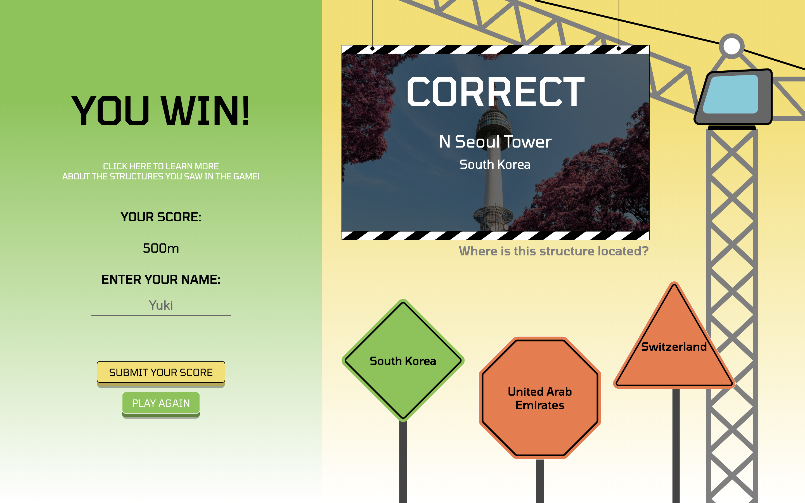
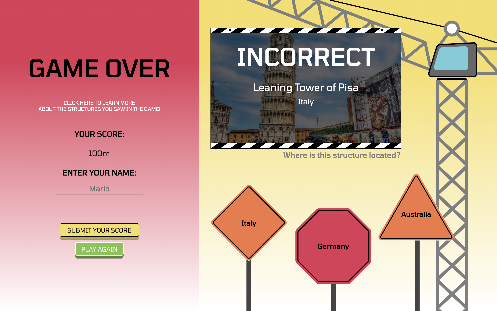
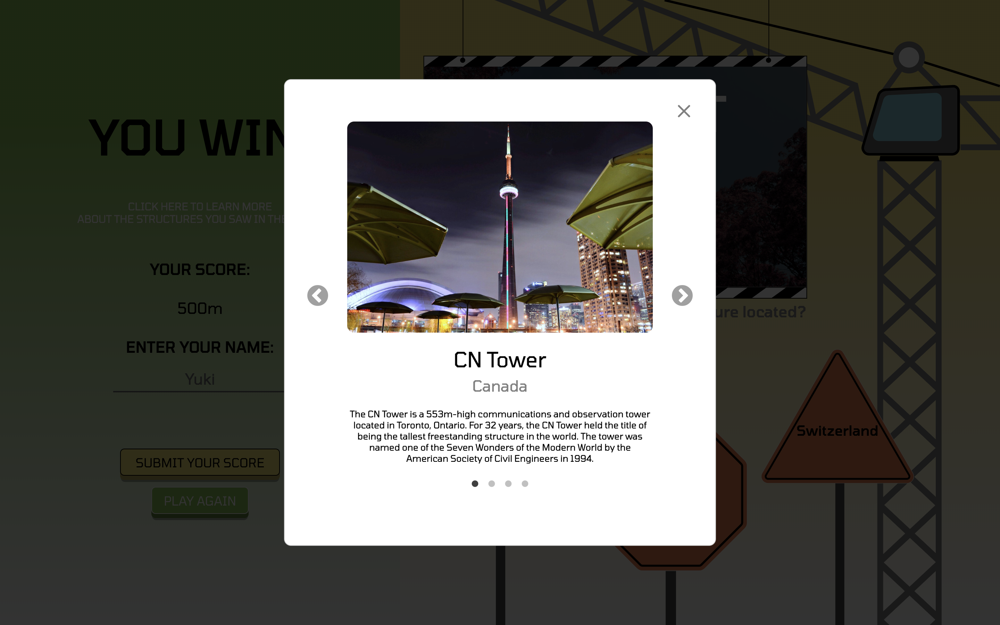
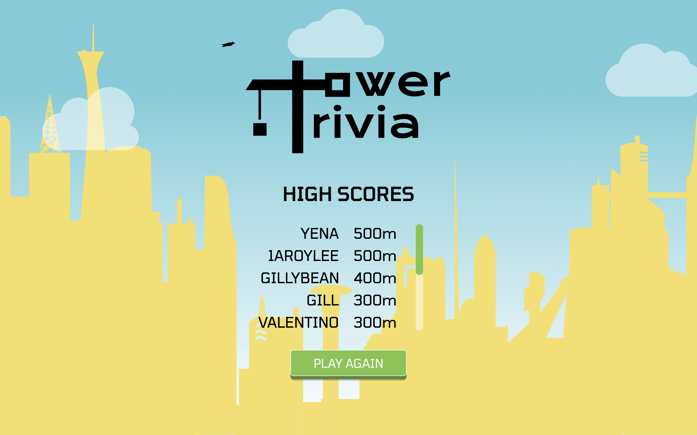

# Tower Trivia

## Introduction

**Tower Trivia** is a responsive web game that tests players’ geographical knowledge of popular world landmarks through multiple-choice trivia questions. The bright and whimsical user interface features cheerful animations that are designed to guide children through an entertaining educational journey. A large library of trivia questions contributes to the game’s replay value, allowing players many chances to earn a top spot on the high scores list.

**Play the game here: [http://tower-trivia.herokuapp.com/](http://tower-trivia.herokuapp.com/).** Note that the site has been optimized for Google Chrome on desktop computers in full-screen mode. Because the site is hosted on Heroku, it goes to "sleep" after 1 hour of inactivity; please allow the site 5 minutes to "wake up" after opening the link for the first time, then reload the page.

## Screenshots

**Landing Page:**

**Game Page:**

**"You Win" Page:**

**"Game Over" Page:**

**"Learn More" Modal:**

**High Scores Page:**

## Technologies

- [SCSS](https://sass-lang.com/)
- [React](https://reactjs.org/)
- [Axios](https://github.com/axios/axios)
- [Node](https://nodejs.org/en/)
- [Express](https://expressjs.com/)

## Features

- Challenge yourself to identify the location of famous structures around the world through multiple-choice trivia questions
- Enjoy an animated visualization of your tower getting taller by answering correctly and increasing your score
- At the end of each game, read an educational description of the structures you saw in that game to learn more about it
- Save your high score and compare it to existing scores

## Status

The game was built as my graduate project for BrainStation's Web Development Diploma Program that I completed in Toronto, Canada. All game functionality and styling for a desktop-only version of the site was built within 1.5 weeks. This version was presented to the tech community at a showcase event in December 2019.

After the course ended, I increased the responsiveness of the site for various mobile, tablet, and desktop screens, and deployed the site on Heroku.

### Ideas for Future Enhancements:

- Introduce difficulty levels (e.g. easy, medium, and hard) to allow children of all ages to play and garner achievements by conquering each level. More difficult questions are reserved for lesser-known structures and may require the player to identify both the name and location of the structures.
- Rather than capping the game at 4 questions, allow players to keep playing until they answer incorrectly. This will increase the range of high scores that players are able to achieve.
- Add more questions (to the current list of 40) to reduce the likelihood of repeated questions if the game is played again.
- Enhance the tower block "dropping" animations to more realistically mimic a swinging crane.
- Add a timer for each question.

## Inspiration

My dream is to build design-driven digital infrastructure that can educate the world. This is what led me to design an educational game that features pure CSS animations and bright graphics created using Adobe Illustrator.

Why the tower theme? Before I became a web developer, I was a licensed bridge engineer. I am fascinated about structures!

## Contact

Created by [Yuki Kishimoto](https://ca.linkedin.com/in/yukikishimoto)